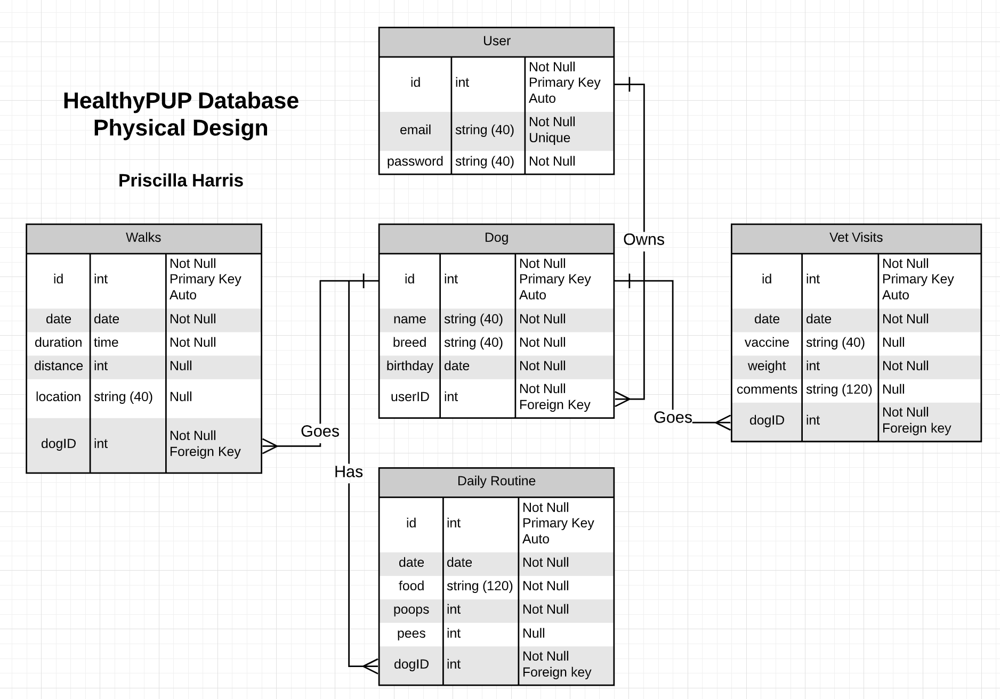

## Physical Database Design

This is the underlying database design for the Healthy PUP Application.
The Healthy PUP Application (HPA) will store a User's Dog, and all associated Records. 
These Records include Daily Routine, Vet Visits, and Walk Records.
These Records are stored in different tables (Users, Dog, Daily Routine, Vet Visits, Walks).

[Back](README.md)
